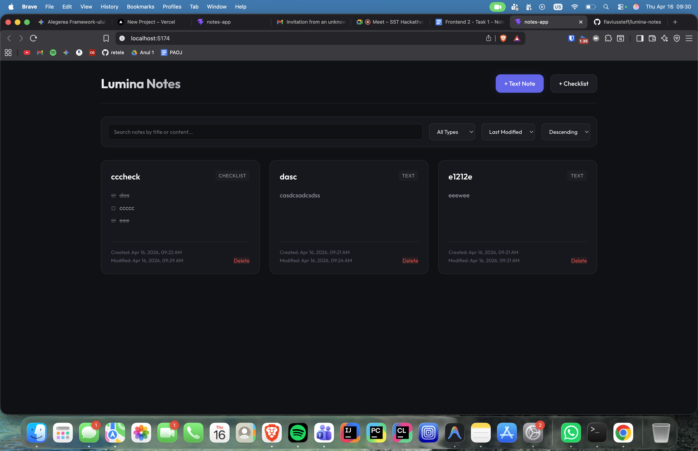
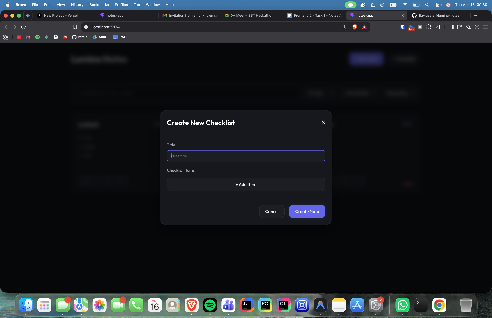
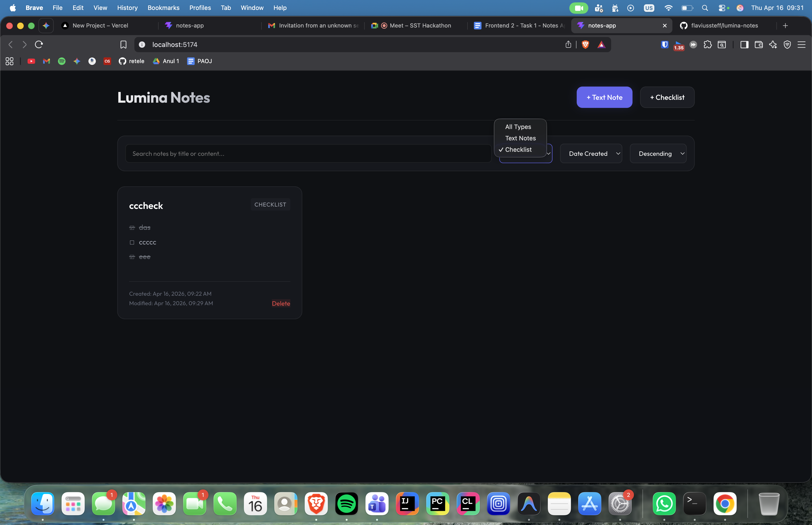

# Lumina Notes - React Developer Assessment

A premium, high-performance Notes Application built with React and Vite. This app features a mock asynchronous Storage Service that mimics an API layer over `localStorage` to ensure memory efficiency and scalability.

## ✨ Features

- **Dynamic Grid View**: Responsive layout with glassmorphic cards and hover effects.
- **Two Note Types**: Supports both dedicated **Text Notes** and **Checklists**.
- **Real-time Search**: Search through note titles and content/checklist items.
- **Advanced Filtering**: Filter by note type (Text/List).
- **Date-based Sorting**: Sort by "Modified At" or "Created At" dates.
- **Persistence**: Data persists in `localStorage` across browser sessions.
- **Memory Optimized**: Queries are performed in a mock service layer, returning only the current page view to the UI.

## 📸 Product Demo

### Main Dashboard
The main dashboard provides a clean, grid-based overview of all your notes. Each card displays a preview of the content, along with creation and modification timestamps. The glassmorphic design and subtle hover animations provide a premium feel.



### Intelligent Editors
Easily switch between standard text notes and interactive checklists. The checklist editor allows for rapid item addition and status toggling, perfect for shopping lists or daily tasks.



### Search & Organization
Powerful filtering and sorting tools help you find what you need instantly. Filter by note type or sort by specific dates to keep your workspace organized.



## 🚀 Getting Started

### Prerequisites
- Node.js (v18 or higher recommended)
- npm or yarn

### Installation
1. Navigate to the project directory:
   ```bash
   cd notes-app
   ```
2. Install dependencies:
   ```bash
   npm install
   ```
3. Start the development server:
   ```bash
   npm run dev
   ```
4. Open the application in your browser at the URL provided in the terminal (usually `http://localhost:5173`).

## 🛠 Tech Stack
- **Framework**: [React](https://reactjs.org/)
- **Build Tool**: [Vite](https://vitejs.dev/)
- **Styling**: Vanilla CSS (Premium Dark Mode)
- **Icons**: Unicode/CSS Icons (No external dependencies)
- **Storage**: `localStorage` (Wrapped in an Async Service)
